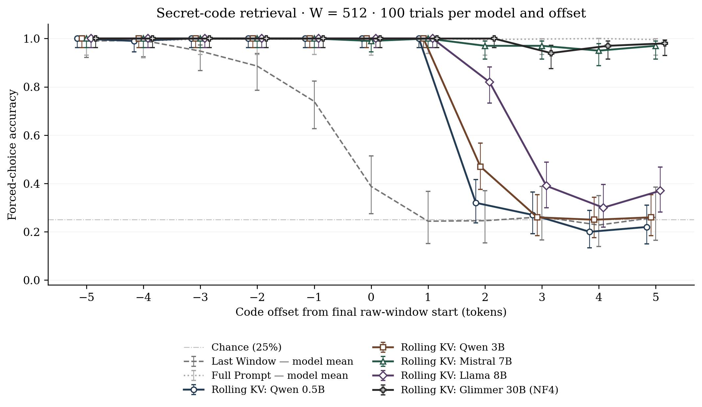
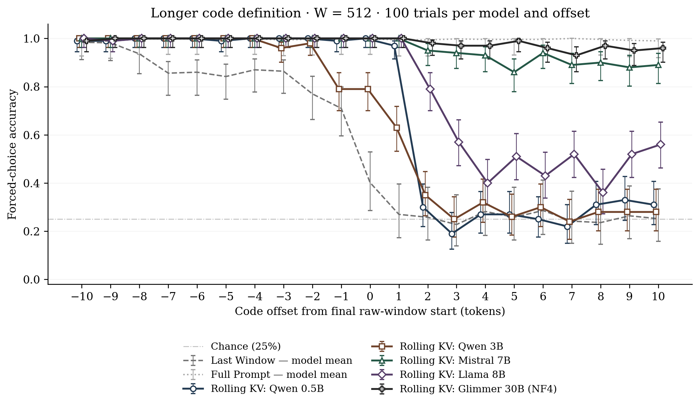
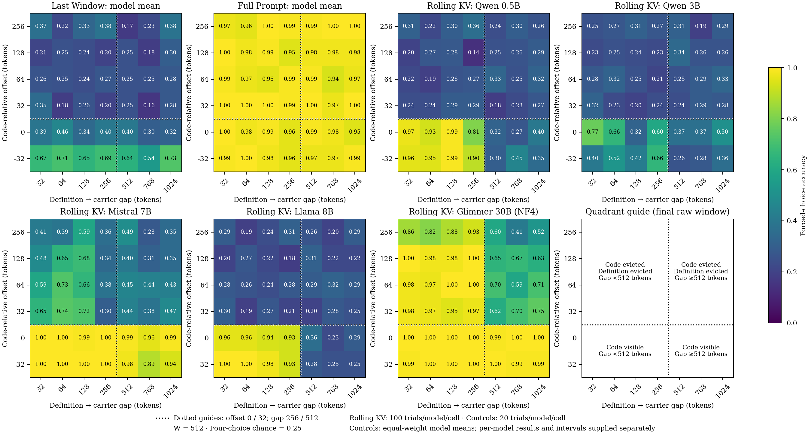

# Thinking Outside the Box

**Retention and Transmission of Information in Sliding-Window KV Inference**

A fixed-size rolling KV cache retains previously computed states while processing a longer sequence. We test whether information from tokens outside the final raw window can still be used to retrieve a secret code. Five open-weight models are evaluated under **Rolling KV**, **Last Window** (recompute only the final raw window), and **Full Prompt** conditions. All experiments use a 512-token retained window and four-choice next-token scoring (25% chance accuracy). The runs used a single NVIDIA RTX 3090.

[Paper PDF](paper/Thinking_Outside_the_Box.pdf) · [Methods and offset definitions](docs/METHODS.md) · [Models and numerical settings](docs/MODELS.md) · [Reproduction guide](docs/REPRODUCIBILITY.md)

## Experiment 1: Secret-code retrieval

A short instruction defines a code, and filler moves it across the final window boundary. At offset +1, the code has left the final raw window but remains directly accessible in the final Rolling-KV scoring step: Rolling KV reaches **100% for all five models**, versus **24.4%** for the equal-weight Last Window mean. At +2, direct access to the code's own KV state has ended; Mistral and Glimmer remain highly accurate, while the other models vary.



[Setup, raw results, and reproduction commands](experiments/01_secret_code/README.md) · [Result summary](experiments/01_secret_code/results/summary.csv) · [Vector figure](experiments/01_secret_code/figures/experiment1_five_models_color.pdf)

## Experiment 2: Longer code definition

The code follows a longer defining phrase, so parts of its definition leave the final raw window before the code does. At offset 0, the equal-weight Last Window mean is **40.2%**, compared with **95.8%** for Rolling KV. After the code's own KV state is no longer directly accessible, Mistral and Glimmer sustain the strongest retrieval; Llama shows a shorter-lived effect.



[Setup, raw results, and reproduction commands](experiments/02_code_defined/README.md) · [Result summary](experiments/02_code_defined/results/summary.csv) · [Vector figure](experiments/02_code_defined/figures/experiment2_five_models_color.pdf)

## Experiment 3: Definition-to-carrier distance

An earlier instruction identifies a marker; after a controlled filler gap, that marker appears beside the code. We vary the filler gap and the code's final-window offset independently. With a gap of **at least 512 filler tokens** and the code evicted, Rolling KV averages **62.9% for Glimmer** and **39.9% for Mistral** across those grid cells. The other three models remain close to the 25% chance level in that region. The gap counts filler before the carrier; the marker prefix adds further tokens between the definition and code.



[Setup, raw results, and reproduction commands](experiments/03_definition_to_carrier/README.md) · [Result summary](experiments/03_definition_to_carrier/results/summary.csv) · [Vector figure](experiments/03_definition_to_carrier/figures/experiment3.pdf)

## Reproduce

Each experiment directory includes its configuration, saved context examples, trial-level CSVs, model metadata, summaries, and figures. Experiments 1 and 2 use 100 trials per offset, model, and condition. Experiment 3 uses 100 Rolling-KV trials per cell and model; each control uses 20 prompts sampled from those saved trials. See the linked experiment READMEs for exact commands and the [reproduction guide](docs/REPRODUCIBILITY.md) for dependencies, model access, and numerical settings.

Python 3.11+ and a suitable CUDA PyTorch installation are required for full model runs. To inspect a configured run without executing it:

```bash
python -m pip install -e .
python scripts/run_experiment.py --experiment 1 --output runs/experiment1 --dry-run
```

Remove `--dry-run` to execute. Glimmer also requires `python -m pip install -e '.[glimmer]'`.

## Repository map

- [`experiments/`](experiments/): three paper experiments and their recorded outputs.
- [`src/totb/`](src/totb/): prompts, cache handling, inference, and scoring.
- [`scripts/`](scripts/): evaluation, plotting, and context-export commands.
- [`tests/`](tests/): validation checks.
- [`docs/`](docs/): methods, model settings, and reproducibility.
- [`paper/`](paper/): repository copy of the paper; `runs/` contains ignored local outputs.

See [Contributing](CONTRIBUTING.md) for development.

## License

Source code is licensed under the [Apache License 2.0](LICENSE). The paper PDF and experiment figures are separate research materials; consult the paper's arXiv record for its publication license once available.
